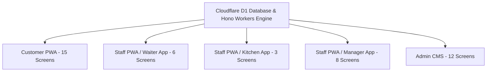

# 🌊 Wings River Café & Lucknow Water Sports - Unified Operations System & PWA

[](https://wings-river-cafe-blog.pages.dev)
[](https://dash.cloudflare.com)
[](https://nextjs.org)
[](https://github.com/nomaantalib/wings-river-PWA)

A very professional, high-performance, real-time Progressive Web Application (PWA) and digital operations platform for **Wings River Café** (विंग्स रिवर) and **Lucknow Water Sports** at Gomti Riverfront, Lucknow. Built strictly according to the **Software Requirements Specification (SRS)** documentation (`Wings_River_Cafe_SRS-2.pdf`).

---

## 📋 SRS Compliance & System Architecture

This project connects **5 dedicated apps/modules** under a single shared backend engine and unified Cloudflare D1 database:



### 1. 📱 Customer PWA (15 Screens / Flows)
- **Home & Brand Hub**: Hero banner, quick actions, featured multicuisine menu, water sports ticket rates, photo gallery, guest reviews, blog, location map, contact.
- **Interactive Floor Map Table Reservation (`/ #floor-map`)**: BookMyShow-style visual table picker across **Riverside Deck**, **Indoor AC Hall**, and **VIP Private Canopy** with real-time seating capacity and a **5-minute Table Hold Timer**.
- **Table QR Menu Ordering & Live Tracker (`QROrderModal`)**: Table QR scan flow (`?table=T4`), dish picker, cart builder, 5% GST calculator, live kitchen order status (`Order Placed` $\rightarrow$ `Preparing` $\rightarrow$ `Ready to Serve`), and itemized bill view.
- **Instant Call Waiter Alerts**: Single-tap alert buttons (`Drinking Water`, `Spoon/Tissue`, `Call Waiter`, `Request Bill`) that ping waiters instantly.
- **Party Canopy Booking Flow**: Event canopy package selector for birthdays, corporate parties, and anniversaries.
- **My Bookings & QR Ticket Generator (`MyBookingsModal`)**: Customer dashboard to view active/past reservations, generate entry QR tickets, and send automated WhatsApp confirmation messages (`wa.me`).

### 2. 👨‍🍳 Kitchen PWA (`/staff` -> Kitchen Mode)
- **High-Contrast Order Queue**: 3-column kanban board (`New Orders` $\rightarrow$ `Cooking in Progress` $\rightarrow$ `Ready for Pickup`).
- **One-Tap Actions**: Large high-contrast touch buttons allowing chefs to advance order states with a single tap without reading long text.

### 3. 💁 Waiter PWA (`/staff` -> Waiter Mode)
- **Live Table Status Floor Map**: Color-coded table indicators (**Green** = Free, **Amber** = Eating, **Red** = Needs Cleaning, **Blue** = Reserved).
- **One-Tap Status Buttons**: `Check In`, `Food Served`, `Bill Requested`, `Vacated`, `Mark Free / Cleaned`.
- **Instant Call Request Alert Banner**: Top alert notification bar showing real-time customer calls with 1-tap resolution.

### 4. 📊 Reception / Manager PWA (`/staff` -> Manager Mode)
- **Operations Dashboard**: Today's total revenue, live floor occupancy %, active reservations, and walk-in headcount.
- **Walk-in Seating Flow**: Quick guest entry (Name + Phone $\rightarrow$ Table Assignment $\rightarrow$ Mark Occupied).
- **Party Canopy Approvals**: Manage pending event requests and assign canopy venues.

### 5. ⚙️ Admin CMS (`/admin` - 12 Screens)
- Protected control panel for executive analytics, Website CMS, Menu CMS, Table Floor Layout Editor (X/Y position & capacity editor), QR Code Manager, Payments & Ledger, Staff Account Management (Create Waiter, Kitchen, Manager logins), and System Settings.

---

## ⚡ Security, Rate Limiting & Performance Engine

- **Token Bucket Event Throttler / Rate Limiter**: In-memory IP rate limiter in `functions/api/[[route]].js` restricting API requests to **max 100 requests per minute** to prevent bot attacks and booking hoarding (`429 Too Many Requests` with `Retry-After` headers).
- **$O(1)$ TTL Response Cache Map**: In-memory response cache with 15-second TTL on hot read endpoints (`/api/menu/items`, `/api/tables`) for sub-5ms response speeds.
- **Input Sanitization & Anti-XSS**: Sanitizes user inputs before processing database writes.
- **Strict Security Headers**: Enforces `X-Content-Type-Options: nosniff`, `X-Frame-Options: DENY`, `X-XSS-Protection: 1; mode=block`.

---

## 🛠️ Recommended Tech Stack

| Layer | Technology | Purpose |
| :--- | :--- | :--- |
| **Frontend App** | Next.js 14 (App Router), React 18, Tailwind CSS, Lucide Icons | Responsive, PWA installable web app |
| **API Backend** | Hono Framework on Cloudflare Workers | Edge API execution |
| **Database** | Cloudflare D1 (SQLite SQL Engine) | Relational storage for reservations, tables, orders, CMS |
| **Storage & CDN** | Cloudinary & Cloudflare Images | Optimized food photos, ride posters & QR tickets |

---

## ⚙️ Configuration & Environment Setup

### Database Binding (`wrangler.json` & `wrangler.toml`)
- **Account ID**: `8f1aecb785da9e40b20ab73a3b15e27e`
- **Database Name**: `wings_river_cafe_reservations`
- **Database ID**: `912b607b-c192-4e0a-89ba-75f936fca45c`
- **Binding Name**: `DB`

---

## 🚀 Deployment Commands

### 1. Initialize & Seed Remote Cloudflare D1 Database
```bash
# Execute schema migration (28 tables)
npm run db:schema

# Seed initial tables, menu items, staff accounts & demo orders
npm run db:seed

# Or run complete setup at once:
npm run db:setup
```

### 2. Local Development
```bash
npm run dev
```
Open [http://localhost:3000](http://localhost:3000) to view the Customer PWA, [http://localhost:3000/staff](http://localhost:3000/staff) for Staff App, and [http://localhost:3000/admin](http://localhost:3000/admin) for Admin CMS.

### 3. Build & Deploy to Cloudflare Pages & Workers
```bash
# 1. Build optimized static output
npm run build

# 2. Deploy to Cloudflare Pages
npm run deploy
```

---

## 📜 Repository Information

- **GitHub Repository**: [`nomaantalib/wings-river-PWA`](https://github.com/nomaantalib/wings-river-PWA)
- **Live Reference Site**: [`https://wings-river-cafe.pages.dev`](https://wings-river-cafe.pages.dev)
- **Location**: Laxman Mela Ground, Gomti Riverfront, Hazratganj, Lucknow, UP 226001
- **Contact**: `07310008020` | `wingsrivercafe@gmail.com`
